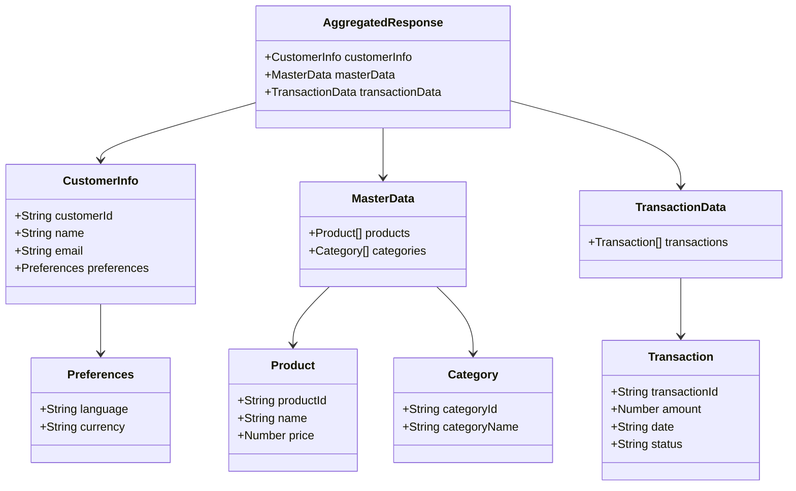
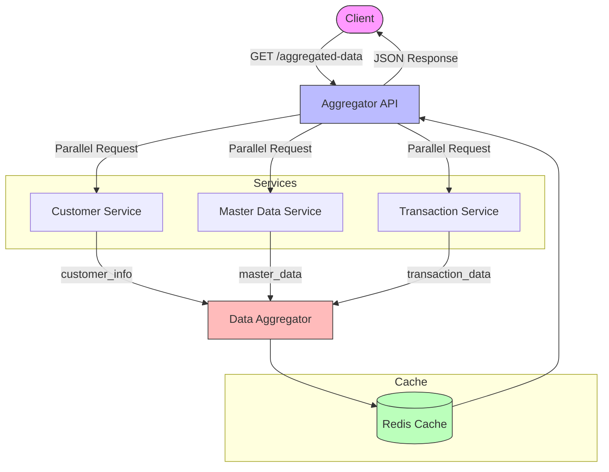
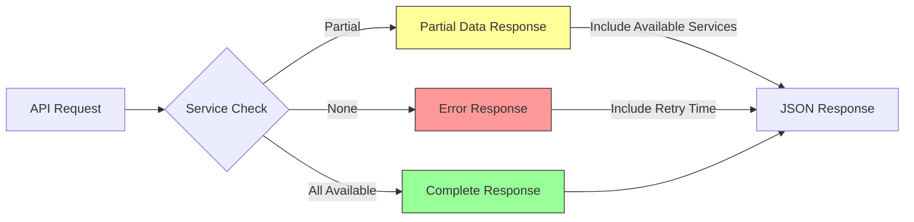

# Aggregator API: Near Real-Time Data Retrieval from Microservices

## 🚀 Project Overview
A high-performance API service designed to aggregate data from multiple microservices efficiently and in near real-time.

## ✨ Key Features
- Parallel data retrieval from 3 microservices
- Near real-time data aggregation
- Intelligent caching mechanism
- Robust error handling
- Advanced performance optimization

## 🏗️ Architecture Design
### Core Components
- Aggregator Service
- Redis Caching Layer
- Parallel Request Mechanism

## 📡 API Endpoint
```
GET /aggregated-data
```

### Request Parameters
| Parameter    | Type     | Required | Description                    |
|--------------|----------|----------|--------------------------------|
| customer_id  | String   | Yes      | Unique identifier for customer |
| data_type    | String   | No       | Default: "all"                 |
| timestamp    | DateTime | No       | Specific time range            |

## 🔒 Security Considerations
- OAuth 2.0 Authentication
- Rate Limiting
- Data Masking
- Secure API Endpoint

## 🚥 Performance Optimization Strategies
- Parallel API Calls
- Circuit Breaker Pattern
- Fallback Mechanism
- Intelligent Caching (Redis)

## 🔍 Monitoring & Observability
- Distributed Tracing (Jaeger)
- Comprehensive Logging
- Prometheus Metrics

## 📊 Caching Strategy
- Redis Cache Implementation
- TTL: 30-60 seconds
- Automatic Cache Invalidation

## 🛡️ Error Handling
```json
{
  "error": {
    "code": "PARTIAL_DATA_FETCH",
    "message": "Some services unavailable",
    "available_services": ["customer", "transaction"],
    "retry_after": 5
  }
}
```

## 💡 Advantages
- Reduced Client-Side Overhead
- Highly Scalable
- Efficient Data Retrieval
- Near Real-Time Performance

## ⚠️ Considerations
- Careful Timeout Design
- Increased System Complexity
- Continuous Monitoring Required

## 🔧 Recommended Tech Stack
- Language: Rust
- Web Framework: Actix Web
- Caching: Redis
- Tracing: Jaeger
- Metrics: Prometheus

## 📝 Example Pseudo Code
```rust
async fn get_aggregated_data(customer_id: String) {
    // Parallel Microservice Calls
    let (customer_data, master_data, transaction_data) = tokio::join!(
        fetch_customer_data(customer_id),
        fetch_master_data(customer_id),
        fetch_transaction_data(customer_id)
    );

    // Aggregate & Return
    AggregatedData {
        customer_info: customer_data,
        master_data,
        transaction_data
    }
}
```

## 📐 Data Structure Diagrams

### Class Diagram


### Data Flow Diagram


### Error Handling Flow


## 📊 Data Structure Explanation

### Response Data Structure
The API response is structured hierarchically to provide comprehensive data from all microservices:

```json
{
  "customer_info": {
    "customer_id": "string",     // Unique identifier for the customer
    "name": "string",            // Customer's full name
    "email": "string",           // Customer's email address
    "preferences": {
      "language": "string",      // Preferred language
      "currency": "string"       // Preferred currency
    }
  },
  "master_data": {
    "products": [
      {
        "product_id": "string",  // Unique product identifier
        "name": "string",        // Product name
        "price": "number"        // Product price
      }
    ],
    "categories": [
      {
        "category_id": "string", // Category identifier
        "category_name": "string" // Category name
      }
    ]
  },
  "transaction_data": {
    "transactions": [
      {
        "transaction_id": "string", // Unique transaction identifier
        "amount": "number",         // Transaction amount
        "date": "string",          // Transaction date (ISO 8601 format)
        "status": "string"         // Transaction status (e.g., "completed", "pending")
      }
    ]
  }
}
```

### Data Flow
1. **Request Processing**:
   - Client sends request with `customer_id`
   - API validates request parameters
   - Parallel requests initiated to microservices

2. **Data Aggregation**:
   - Customer service → `customer_info`
   - Master data service → `master_data`
   - Transaction service → `transaction_data`

3. **Response Assembly**:
   - Data from all services combined
   - Null checks performed
   - Response formatted according to schema

### Cache Structure
```redis
KEY: "customer:{customer_id}"
TTL: 60 seconds
VALUE: {
    // Complete aggregated response
}
```

### Error Response Structure
```json
{
  "error": {
    "code": "string",           // Error code (e.g., "PARTIAL_DATA_FETCH")
    "message": "string",        // Human-readable error message
    "available_services": [],   // List of currently available services
    "retry_after": "number"    // Suggested retry time in seconds
  }
}
```

## 🔢 Version
- API Version: v1.0.0
- Last Updated: 2024-12-16
- Compatibility: Rust 1.70+

## 🚦 Response Codes
| Status Code | Description |
|------------|-------------|
| 200 | Success |
| 400 | Bad Request |
| 401 | Unauthorized |
| 403 | Forbidden |
| 404 | Not Found |
| 429 | Too Many Requests |
| 500 | Internal Server Error |

## 🏁 Getting Started
### Prerequisites
- Rust 1.70+
- Redis 6.0+
- Docker (optional)

### Installation
```bash
git clone <repository-url>
cd aggregator-api
cargo build
```

### Environment Setup
```bash
cp .env.example .env
# Configure your environment variables
```

### Quick Start
```bash
cargo run
```

## 🌟 Best Practices
1. Implement circuit breakers
2. Use connection pooling
3. Add comprehensive logging
4. Monitor system performance
5. Implement graceful degradation

## 🚧 Future Improvements
- GraphQL Integration
- Advanced Caching Strategies
- Machine Learning-based Optimization

---

**Created with ❤️ for High-Performance Microservices Architecture**