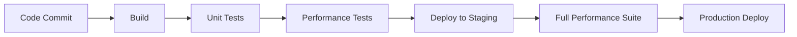

# แผนกลยุทธ์การทดสอบประสิทธิภาพแบบ Agile (Agile Performance Test Strategy Plan)

> Version: 1.0.0  
> Last Updated: 2024-12-16  
> Owner: Performance Testing Team  
> Status: Active

## 📋 1. วิสัยทัศน์และเป้าหมาย (Vision & Goals)
- สร้างระบบที่มีประสิทธิภาพสูงและตอบสนองความต้องการของผู้ใช้
- ทดสอบและปรับปรุงระบบอย่างต่อเนื่องตามหลัก Agile
- สร้างวัฒนธรรม Performance-First Mindset ในทีม

## 🎯 2. Performance Acceptance Criteria
### 2.1 Definition of Done (DoD)
- **Response Time**: < 500ms (P95)
- **Throughput**: 1,000 RPS
- **Error Rate**: < 0.1%
- **Test Coverage**: > 90%

### 2.2 User Stories & Performance Goals
```agile
As a customer service representative
I want to retrieve customer data within 500ms
So that I can provide quick service to customers

As a system administrator
I want to monitor real-time system performance
So that I can respond to issues promptly
```

## 🏃‍♂️ 3. Agile Testing Sprints

### Sprint 1: Foundation (2 weeks)
#### Stories
- Setup test environment
- Create basic test scripts
- Implement monitoring
#### Metrics
- Environment readiness
- Basic performance baseline

### Sprint 2: Core Testing (2 weeks)
#### Stories
- Load testing basic flows
- Implement CI/CD pipeline
- Setup alerting
#### Metrics
- Response time baseline
- Error rate baseline

### Sprint 3: Advanced Testing (2 weeks)
#### Stories
- Stress testing
- Failover testing
- Cache optimization
#### Metrics
- System limits
- Recovery times

### Sprint 4: Optimization (2 weeks)
#### Stories
- Performance tuning
- Scaling tests
- Documentation
#### Metrics
- Improved response times
- Higher throughput

## 🔄 4. Daily Performance Testing Routine

### 4.1 Daily Standup Focus
- Performance metrics review
- Blocking issues
- Test results discussion

### 4.2 Daily Test Cycles
- Smoke tests: ทุกครั้งที่ deploy
- Load tests: ทุกวันตอน 22:00
- Performance monitoring: ตลอด 24 ชั่วโมง

## 📊 5. Agile Metrics & KPIs

### 5.1 Sprint Metrics
- Velocity ของการทดสอบ
- Test coverage เพิ่มขึ้นต่อ sprint
- จำนวน performance bugs ที่แก้ไข

### 5.2 Technical Metrics
- Response time trends
- Resource utilization
- Error rates
- Apdex score

## 🛠 6. Continuous Integration/Deployment

### 6.1 Automated Testing Pipeline


### 6.2 Performance Gates
- ไม่ผ่าน CI ถ้า P95 > 500ms
- ไม่ผ่าน CD ถ้า Error Rate > 0.1%
- Auto-rollback ถ้า CPU > 80%

## 📈 7. Sprint Retrospectives

### 7.1 Performance Review
- ทบทวน metrics ทุก sprint
- ปรับ test strategy ตามผลลัพธ์
- แชร์ learning points

### 7.2 Adaptation Points
- ปรับ test scenarios
- Fine-tune acceptance criteria
- ปรับปรุง test coverage

## 🔍 8. Monitoring & Feedback Loops

### 8.1 Real-time Monitoring
- Grafana dashboards
- Alerting thresholds
- Trend analysis

### 8.2 Feedback Channels
- Daily performance reports
- Sprint performance reviews
- Stakeholder feedback

## 🚨 9. Risk Management & Mitigation

### 9.1 Agile Risk Response
- Fast rollback strategy
- A/B testing for major changes
- Feature flags for risk control

### 9.2 Contingency Planning
- Backup test environments
- Alternative test scenarios
- Quick response procedures

## 📱 10. Stakeholder Communication

### 10.1 Daily Updates
- Performance metrics dashboard
- Test progress updates
- Blocking issues

### 10.2 Sprint Reviews
- Performance trends
- Achievement vs goals
- Next sprint planning

## 🔄 11. Continuous Improvement

### 11.1 Kaizen Events
- Performance optimization workshops
- Test strategy reviews
- Tool evaluation sessions

### 11.2 Knowledge Sharing
- Best practices documentation
- Team training sessions
- Lessons learned repository

## 🛠️ 12. Test Environment Setup

### 12.1 Required Tools & Versions
- JMeter v5.5+
- Grafana v9.0+
- Prometheus v2.40+
- K6 v0.42+
- Docker v20.10+
- Kubernetes v1.25+

### 12.2 Environment Configuration
```bash
# Test Environment Setup
export TEST_ENV=staging
export GRAFANA_PORT=3000
export PROMETHEUS_PORT=9090

# Performance Test Configuration
export VUSERS=1000
export RAMP_UP_TIME=300
export TEST_DURATION=3600
```

### 12.3 Test Data Requirements
- ข้อมูลผู้ใช้จำลอง 100,000 records
- Transaction data 1,000,000 records
- Master data 50,000 records
- Cached data 20GB

## 📚 13. References & Resources

### 13.1 Related Documents
- [Performance Test Guidelines](link-to-guidelines)
- [CI/CD Pipeline Documentation](link-to-pipeline-docs)
- [Incident Response Playbook](link-to-playbook)
- [Tool-specific Documentation](link-to-tools)

### 13.2 Glossary
| Term | คำอธิบาย |
|------|----------|
| RPS | Requests Per Second - จำนวนคำขอต่อวินาที |
| P95 | 95th Percentile - ค่าที่แสดงว่า 95% ของข้อมูลมีค่าต่ำกว่าจุดนี้ |
| Apdex | Application Performance Index - ดัชนีวัดความพึงพอใจของผู้ใช้ |
| MTTR | Mean Time To Recovery - เวลาเฉลี่ยในการกู้คืนระบบ |

### 13.3 Testing Tools Documentation
- [JMeter Documentation](https://jmeter.apache.org/docs/)
- [K6 Documentation](https://k6.io/docs/)
- [Grafana Documentation](https://grafana.com/docs/)
- [Prometheus Documentation](https://prometheus.io/docs/)

---

**Note**: แผนนี้จะได้รับการปรับปรุงทุก sprint ตามหลัก Agile เพื่อให้สอดคล้องกับความต้องการและสถานการณ์ที่เปลี่ยนแปลง